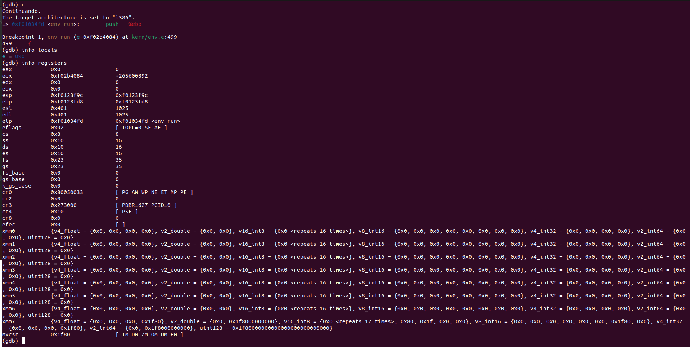
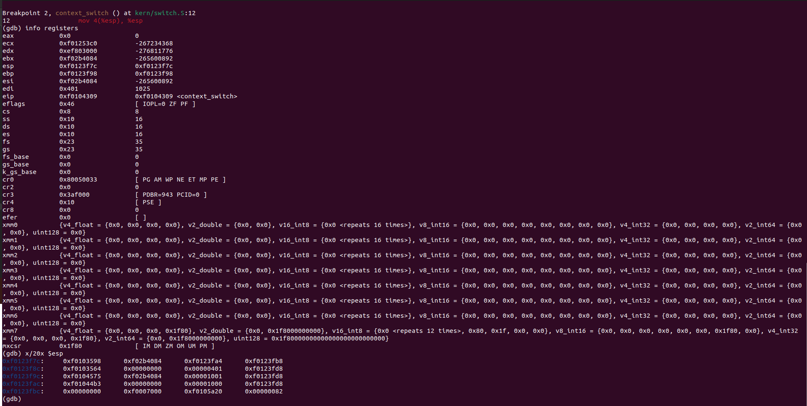
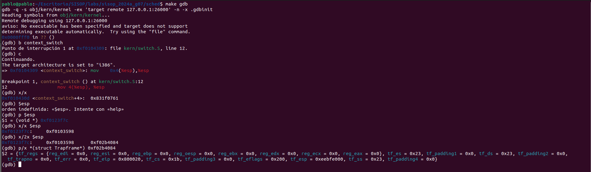
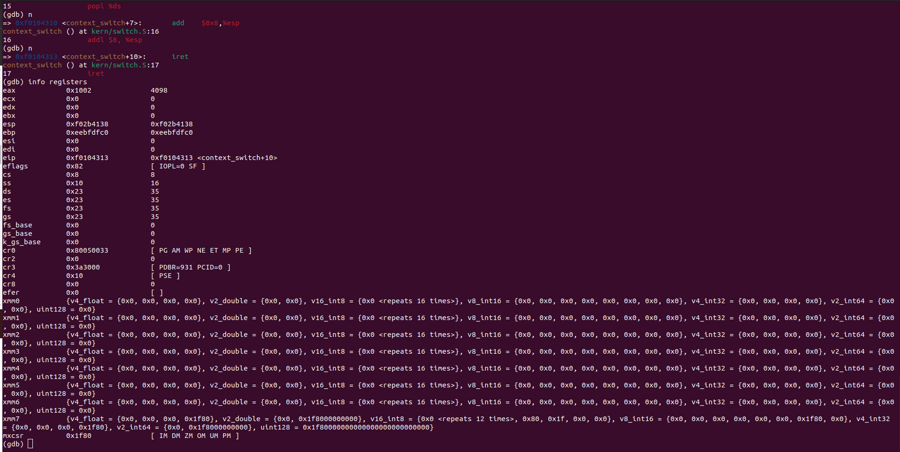

# Sched

## GDB (Cambio de contexto)

## Lógica de la implementación en el scheduler por prioridades.

La implementación realiza una búsqueda circular a través de todos los entornos para encontrar el entorno ejecutable con la mayor prioridad:

- **Prioridad**: Cada entorno tiene un valor de prioridad asociado, donde un valor menor indica una mayor prioridad.
- **prioridad_actual**: Variable para rastrear la prioridad más baja encontrada.
- **start**: Índice de inicio para la búsqueda de entornos ejecutables (runnable).

Una vez que se encuentra el entorno con la mayor prioridad, se incrementa su contador de ejecuciones y se ajusta su prioridad si es necesario:

- **Incremento de Prioridad**: Cada 5 ejecuciones, la prioridad del entorno seleccionado se incrementa para evitar que el entorno monopolice la CPU.
- **Reinicio de Prioridades**: Si algún entorno alcanza la prioridad mínima, todas las prioridades se reinician al valor máximo (MAXIMA_PRIORIDAD).

